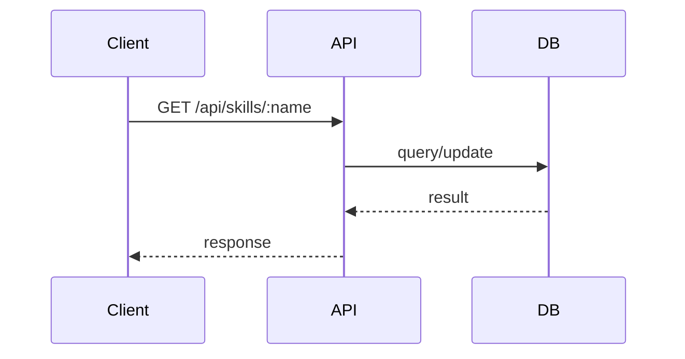
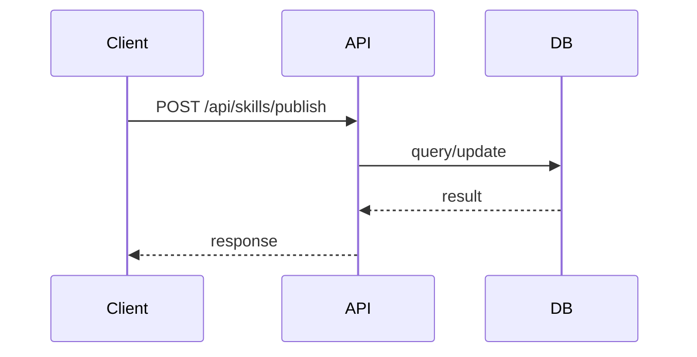
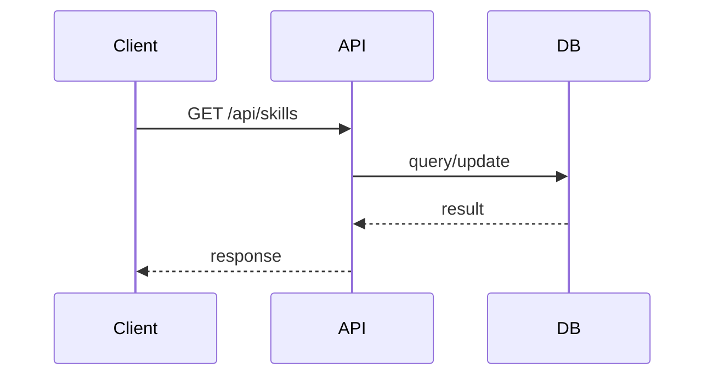

# Top flows

assumption: these sequences are inferred from the routes and entities found elsewhere in this outline; no flow documentation exists for them yet.

## GET /api/skills/:name

## POST /api/skills/publish

## GET /api/skills

